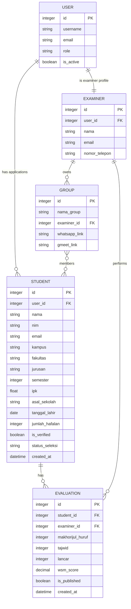

# ERD (Entity Relationship Diagram) — TahfizhQu 🔧

Dokumentasi ERD untuk model-model utama pada aplikasi TahfizhQu.

## Diagram ER (Mermaid)

---

## Keterangan singkat (hubungan utama)
- User (extends Django `AbstractUser`) dapat memiliki banyak `Student` (aplikasi pendaftaran). ✅
- User berhubungan satu-ke-satu dengan `Examiner` untuk role penguji. ✅
- `Group` berelasi many-to-many dengan `Student` (anggota group). ✅
- `Examiner` memiliki relasi one-to-many ke `Group` (seorang examiner mengelola banyak group). ✅
- `Evaluation` menyimpan hasil penilaian yang mengacu ke `Student` dan `Examiner`. ✅

---

Referensi implementasi: `scholarship/models.py`.

Mau saya juga buatkan gambar SVG/PNG yang lebih lengkap (kotak + garis) dan menambahkan link/preview di `README.md`? (jawab: ya/tidak) ✨